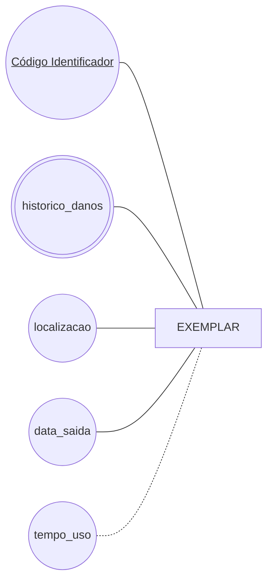

ex03.md — desenhe em Mermaid flowchart, na notação de Chen, a entidade EXEMPLAR com cinco atributos: o que identifica (sublinhado), pelo menos um multivalorado ou derivado, e os demais simples. 
Abaixo do diagrama, escreva o parágrafo em português dizendo o que ele afirma sobre o mundo. Confere assim: abra o arquivo no preview do GitHub — se o diagrama aparecer como código cru em vez de desenho, há erro de sintaxe. A notação tem a lista dos cinco tropeços mais comuns.

O diagrama representa a entidade EXEMPLAR, que modela a unidade física específica de um livro pertencente à uma biblioteca. Cada exemplar é identificado pelo seu atributo-chave, nesse caso o código identificador. Para cada exemplar existe um histórico de danos de diversos valores (multivalorado), uma localização, data de saida e um tempo de uso derivado do cálculo da data de saída menos a data atual.