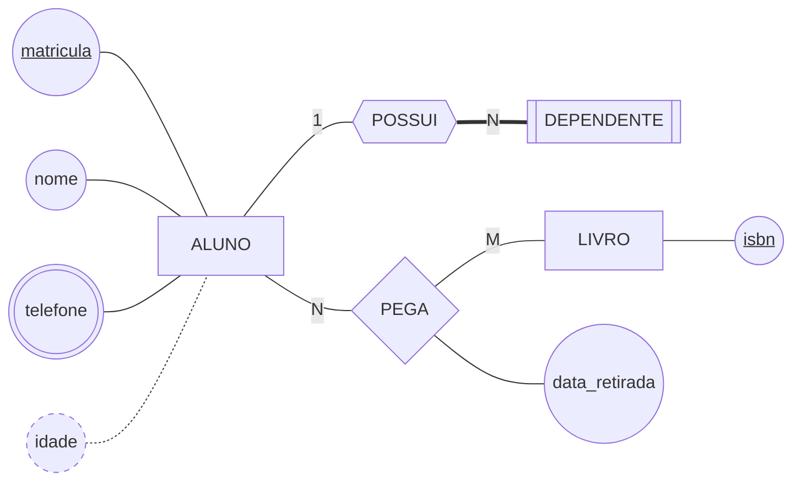

```mermaid
flowchart LR
    mat(("<u>matricula</u>")) --- ALUNO[ALUNO]
    nome((nome)) --- ALUNO
    tel(((telefone))) --- ALUNO
    idade((idade)) -.- ALUNO
    ALUNO ---|1| POSSUI{{POSSUI}}
    POSSUI ===|N| DEP[[DEPENDENTE]]
    ALUNO ---|N| PEGA{PEGA}
    PEGA ---|M| LIVRO[LIVRO]
    PEGA --- dt((data_retirada))
    LIVRO --- isbn(("<u>isbn</u>"))
    classDef derivado stroke-dasharray: 5 5
    class idade derivado
```